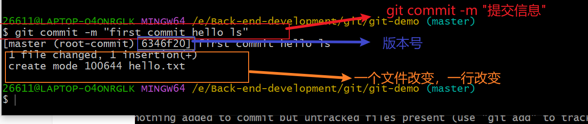
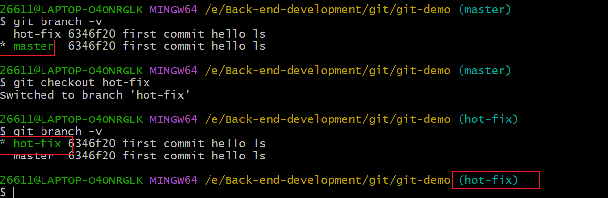
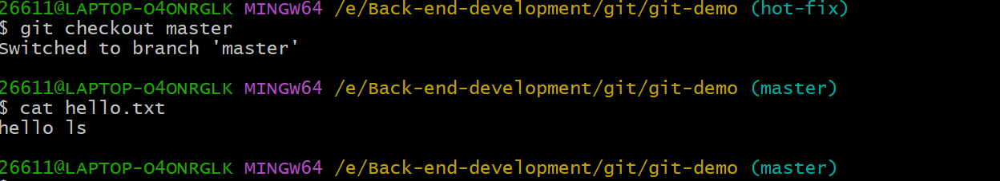
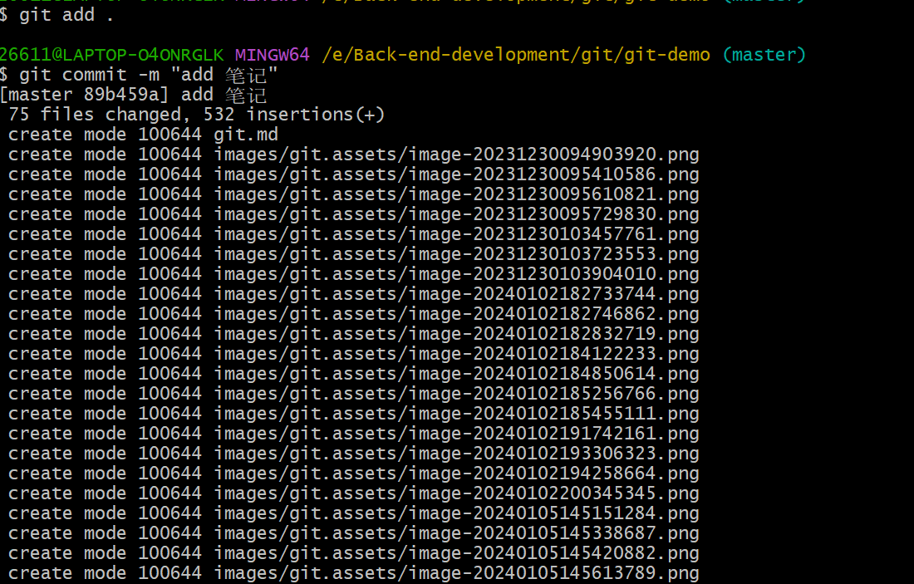
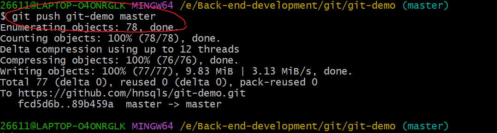
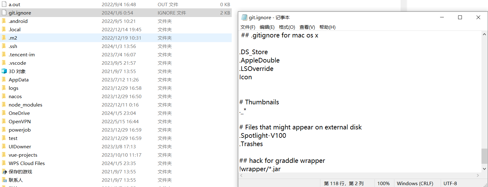
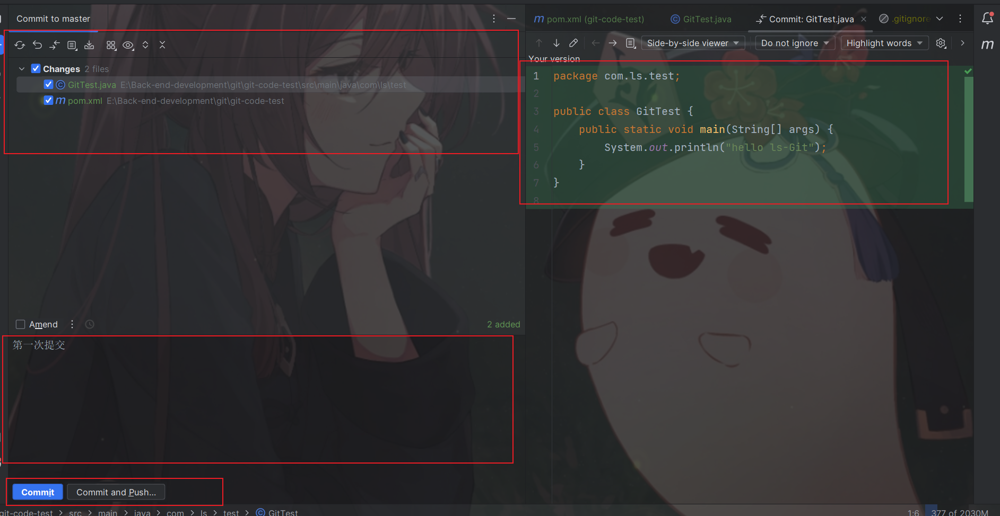
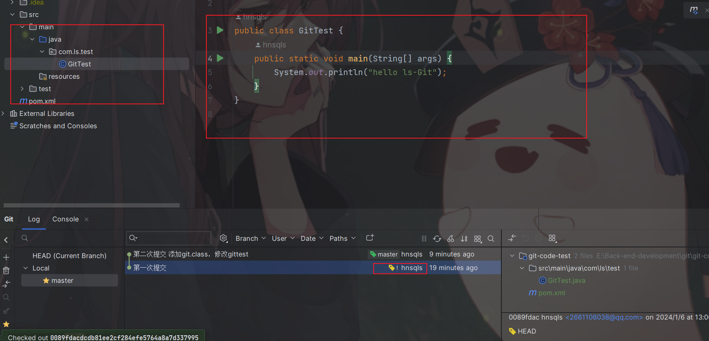

# 1.版本控制


## 1.本地版本控制

## 2.集中式版本控制


## 3.分布式版本控制


# 2.GIT安装

1.删除

* 查看环境变量，删除
* 打开控制面板卸载git


2.安装 下一步

# 3.GIT配置

```shell
git config -l    #git 所有的配置
```


```shell
git config --system --list #系统配置
```


```shell
git config --global --list  #用户配置
```


**GIT相关配置文件**

1) GIT\etc\gitconfig          --system


1)C:user\Administrato\\. gitconfig         当前用户的


> 设置用户名与邮箱

```shell
git config --global user.name "hnsqls"
git config --global user.emial "2661108038@qq.com"
```


# 4. GIT理论

> 工作区域

GIT有四个工作区域，工作区（Working Directory），缓存区（Stage/index），本地仓库（GIt Directory），远程仓库（Remote Directory）


> 工作流程


# 5.GIT项目搭建

> 创建工作目录与常用指令


> 本地搭建仓库

选择合适位置进入git bsah，执行初始化指令，会在该位置生成 .git文件

```shell
git init    #创建全新的仓库
```


> 克隆远程仓库

* 就是将远程的仓库复制到本地

```shell
git clone [url]
```


# 6.GIT 文件状态


# 7.GIT使用

密钥 : 在 c：/administar/.ssh 打开git bash

```bash
ssh-keygen -t rsa
```


# 8. IDEA集成、GIT


# 9 使用过程中的问题

1.  退回commit 版本
   1. git reflog 查看版本号
      1. 

2. git reset --hard <commitid>
   1. 


本地项目出现了问题，好多东西都没了


我想退回到最新，但是出现了下面的情况


--------------------------------------------------------------------------git学习-------------------------------------------------------------

# 10 GIT是什么

* git 就是版本控制的软件

**版本控制**

1. 本地版本控制
   * 虽然在本地更简便的管理本地不同版本的文件，但是不能协同开发
2. 集中式版本控制
   * SVN最具代表性，但是中央服务器宕机了，会影响开发
3. 分布式版本控制

# 11. GIT工作机制


**还有个远程库**

* 只要commit，代码就不可能删除


# 12 GIT常用命令

```shell
git init
```

```shell
git status
```


文件在工作区没有被追踪-->暂存区

```shell
git add .
```


追踪到了文件

不想要这个暂存区的文件怎么办，如下 还在工作区 





```shell
git reflog
git log
```


不同版本的信息，单文件夹就有一个，相当于就是本地的版本控制器


觉得还是之前的版本写的好，就回到之前的版本

```shell
git reflog   #查看版本信息
git reset --hard <commitID>
```


# 13 GIT 分支


* 分支的好处，能够同时进行多个功能开发，提高开发效率
* 各个分支开发过程中，一个分支失败了不会对其他分支有影响，删除该失败分支即可

> 分支的命令

```shell
git branch  <分支名>    #创建分支
git branch -v   #查看分支
git checkout <分支名> #切换分支
git merge <分支名> # 合并分支
```

查看分支 git branch -v

```shell
git branch -v
```


创建分支 git branch <分支名>

```shell
git branch hot-fix
```


**切换分支 git checkout <分支名>**

```shell
git chekout hot-fix
```



* 绿色和* 是指向当前分支 


在hot-fix分支下修改hello.txt 文件


切换到主分支,查看hello.txt

```shell
git checkout master
cat hello.txt
```



发现没有作者信息，这只是指针指向了master分支，master指向的版本并没有添加hot-fix，hot-fix已经修改好了，可以添加到master分支上，也就是分支合并

切换到主分支合并hot-fix分支 **git merge <分支名>**

```shell
git merge hot-fix
```


* hot-fix分支是在master分支的基础上该的，在编写hot-fix分支时，我们没有修改master分支，所以合并的时候没有冲突


> 产生冲突

​     合并分支时，两个分支都修改了相同的文件夹，git就不能自动合并了，会报合并冲突

eg：master分支上的hello.txt 添加 I love china,

​        hot-fix 分支上的hello.txt添加I love Henan, 修改后合并


​      


切换到master分支，合并


怎么解决？

手动解决->在合并状态下查看文件

```shell
vim hello.txt
```


修改成这个样子


之后将文件添加到缓存去，然后commit到本地库

```shell
git add .
git commit -m "解决合并冲突问题"
```


合并成功解决了不能自动合并的冲突，查看一下hello.txt文件


是符合我们的需求的

* 需要注意的是，master分支是符号要求了，但是hot-fix分支并没有修改内容


# 14. GIT团队合作

* 团队内合作


* 跨队外合作


# 16 Github操作

* 创建远程仓库


远程仓库连接：有https连接还有ssh连接


用https连接 复制https  用ssh连接就复制ssh连接

>远程仓库操作

```shell
git remote -v     #查看当前所有远程地址的别名
git remote add 别名 远程地址   # 给远程地址连接起别名
git push 别名 分支        #推送本地分支上的内容到远程仓库
git clone             #将远程仓库内容克隆到本地
git pull 远程仓库别名  远程分支名  #将远程仓库对于分支最新内容拉下来后与当前本地分支直接合并 
```


## push 本地库到远程库

创建上述仓库别名  git remote add 别名 远程地址

```shell
git remote add git-demo 
```


将本地库的代码推送到远程库 git pull 别名 分支

```shell
git pull git-demo master
```


发现报错

切换到master分支后推送


发现还是错，第一次是说网络原因，后几次就不能指向master分支？？？

不明白怎么不行，网络我开了vpngithub也能正常访问

换ssh 

给ssh连接起别名

```shell
git remote add git-demo ssh连接
```


**显示已经存在？怎么删除别名（坑）**


还是报错

..............................

发现是我的命令的问题是 push 而不是pull


查看远程仓库


## 拉取远程库到本地库

可以在github上直接修改远程仓库点开文件修改


远程仓库修改，本地仓库和远程仓库不一致，本地拉去远程仓库保持一致

```shell
pull git-demo master
```


报错！！！！！！！！！！


换了ssh才成功，不懂


拉去远程仓库到本地仓库成功，查看一下文件是否和远程仓库一样


符合

添加本地库笔记push到远程库


```shell
git add .
git commit -m "添加笔记"
git push git-demo master
```





在远程仓库中查看


发现笔记中图片不i可看，发现是路径错误，将绝对路径改成相对路径

参考我的博客：[Typora如何管理图片地址-CSDN博客](https://blog.csdn.net/hnsqls/article/details/134694253?spm=1001.2014.3001.5501)

修改后重新push


ssh更稳定一些


修改为相对路径后github上的笔记图片也不可以看


我直接在github上的编辑markdown笔记发现路径是相对路径


不明白为什么显示不出来（坑）


## CLone远程仓库到本地库

* 需要注意的是Clone、是完完全全将远程库的信息完全copy到本地库上
* pull 是拉去不同的代码进行整合

> 命令

```shell
git clone <项目地址>
```


实验 ： 在新的目录中拉去该项目


查看本地库


很顺利

* CLone所作的事情1.拉去代码2.初始化本地仓库，3.创建别名


## 团队内协作邀请成员到项目中


复制发给邀请的人，别人点击pending invite邀请连接同意就可以加入到项目中了

## 跨团队协作

fork -pullrequest

# 17 IDEA——GIT

## 配置git.ignore 文件


在C:user/实际用户下，创建git.ignore文件

我的电脑是

新建


记事本打开编写一下内容



```shell
## .gitignore for Grails 1.2 and 1.3

# .gitignore for maven 
target/
*.releaseBackup

# web application files
#/web-app/WEB-INF

# IDE support files
/.classpath
/.launch
/.project
/.settings
/*.launch
/*.tmproj
/ivy*
/eclipse

# default HSQL database files for production mode
/prodDb.*

# general HSQL database files
*Db.properties
*Db.script

# logs
/stacktrace.log
/test/reports
/logs
*.log
*.log.*

# project release file
/*.war

# plugin release file
/*.zip
/*.zip.sha1
 
# older plugin install locations
/plugins
/web-app/plugins
/web-app/WEB-INF/classes
 
# "temporary" build files
target/
out/
build/
 
# other
*.iws
 
#.gitignore for java
*.class
 
# Package Files #
*.jar
*.war
*.ear
 
## .gitignore for eclipse
 
*.pydevproject
.project
.metadata
bin/**
tmp/**
tmp/**/*
*.tmp
*.bak
*.swp
*~.nib
local.properties
.classpath
.settings/
.loadpath
 
# External tool builders
.externalToolBuilders/
 
# Locally stored "Eclipse launch configurations"
*.launch
 
# CDT-specific
.cproject
 
# PDT-specific
.buildpath
 
## .gitignore for intellij
 
*.iml
*.ipr
*.iws
.idea/
 
## .gitignore for linux
.*
!.gitignore
!.gitattributes
!.editorconfig
!.eslintrc
!.travis.yml
*~
 
## .gitignore for windows
 
# Windows image file caches
Thumbs.db
ehthumbs.db
 
# Folder config file
Desktop.ini
 
# Recycle Bin used on file shares
$RECYCLE.BIN/
 
## .gitignore for mac os x
 
.DS_Store
.AppleDouble
.LSOverride
Icon
 
 
# Thumbnails
._*
 
# Files that might appear on external disk
.Spotlight-V100
.Trashes

## hack for graddle wrapper
!wrapper/*.jar
!**/wrapper/*.jar
```

完事之后在.gitconfig文件（忽略文件同级目录下）引用忽略配置文件

格式为

```shell
[core]
    xecludesfile =  C:/Users/xxx/git.ignore    
```

* 需要注意的是，在引用全局配置中引用git.ignore文件 路径的斜杠（/）


## Idea

创建maven项目测试


新版的idea会自动识别电脑上的git，不能自动识别的话手动添加一个到git.exe文件下，点击test会提示git版本信息


初始化本地仓库，也就是让该项目由git管理

此时查看文件没有.git文件，可以看出项目并没有被git所管理，当然可以在该位置git bash ```git init``不在赘述


在idea中点击VSC---->


默认就在该项目下创建本地库


说明该项目已经被git管理

添加到缓存区 git add.


文件颜色变绿色 说明加入到了暂存区


添加到本地库

写点东西提交报本地库


先git add. 在git commit

 




颜色变成看正常的颜色


> 切换版本

多提交几次先


当由多个文件改变的时候，可以从整个项目中添加到暂存区


查看版本信息点击VersionContral ----->log


切换版本 

在想要选择的版本单机右键选择checkout revision ”xxxx“




切换成功，代码也回到之前的代码了

切换回去 同上


> 分支


创建分支会复制master分支内容

> 合并分支

* 没有冲突的情况下，也就是master内容不改变，只修改分支内容没然后合并

修改分支内容


不要忘记提交

合并需要先切换到主分支上 

```shell
git checkout master 
git merge hot-fix
```

idea 操作


合并成功


**合并冲突**

分支在master基础上修改的同时， master也修改


commit master


commit hot-fix

合并


？？？ 怎么没冲突


需要手动合并

显示出都修改的地方


> idea中绑定github账号


有浏览器github授权还有token授权选择其一


> 使用idea分享代码到github

正常情况是在github上创建新项目，在本地初始化git项目，写项目，push 到github上

使用idea如何操作呢

VSC->github->share